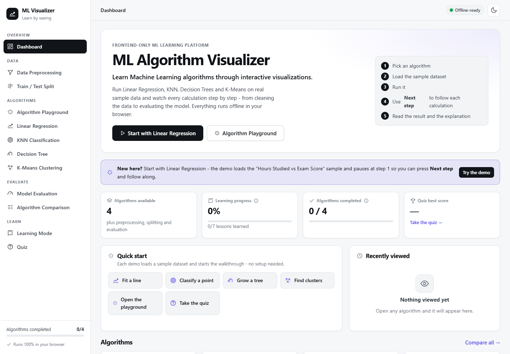
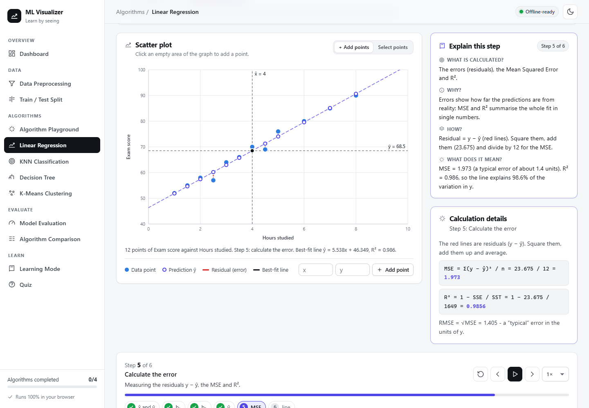
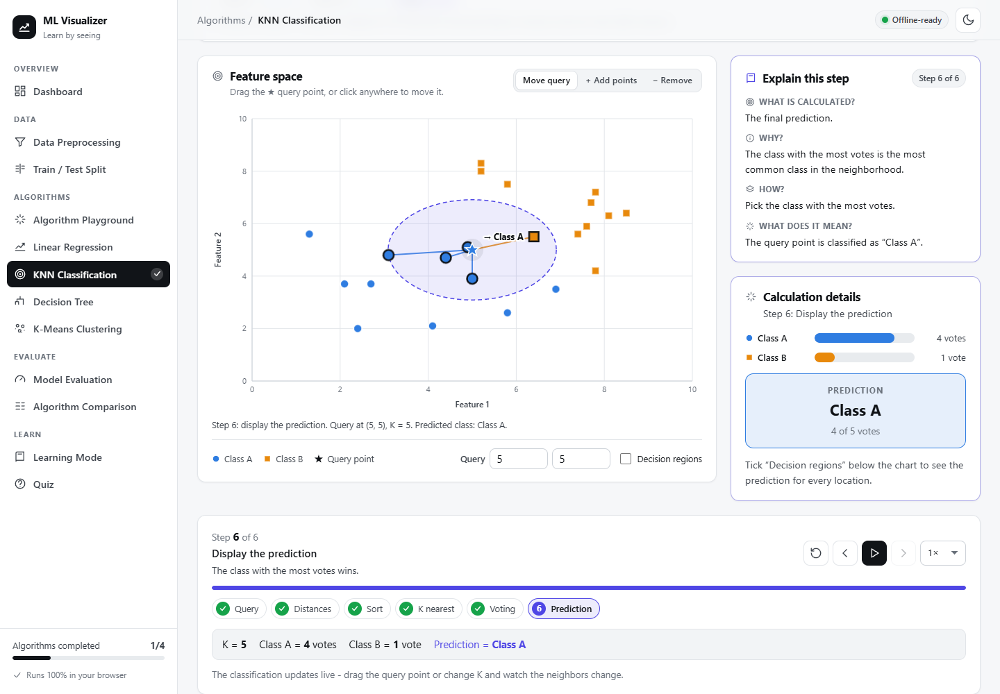
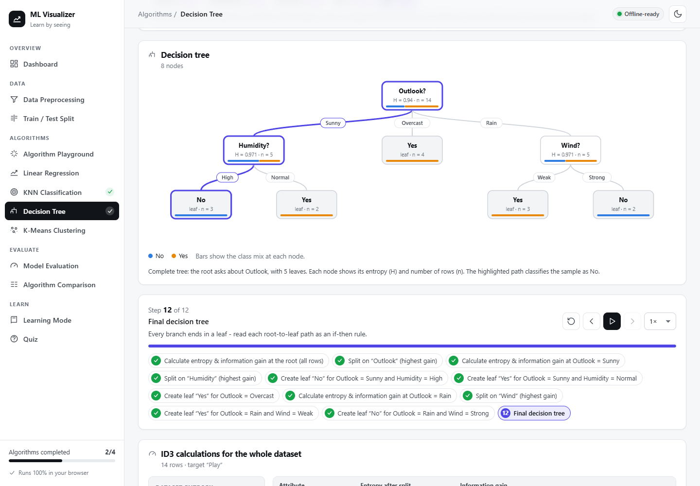
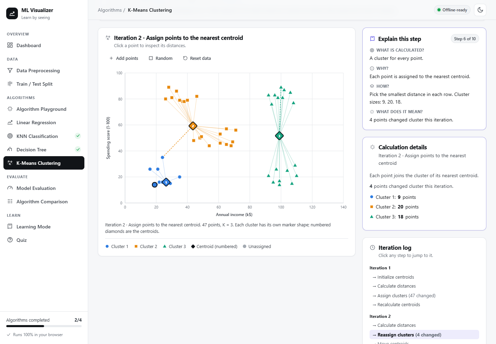
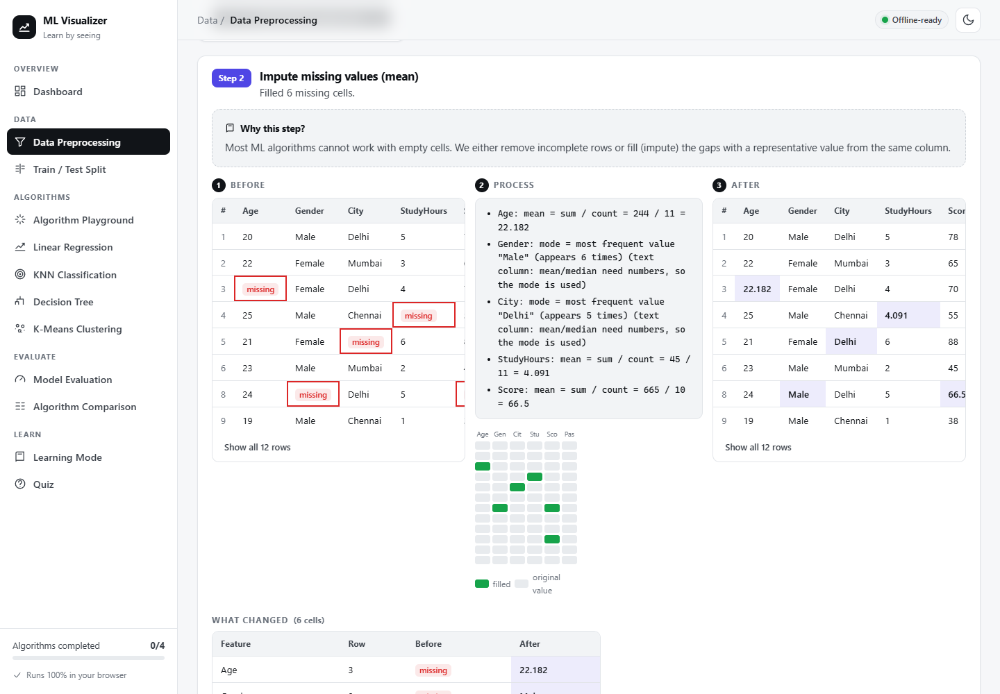
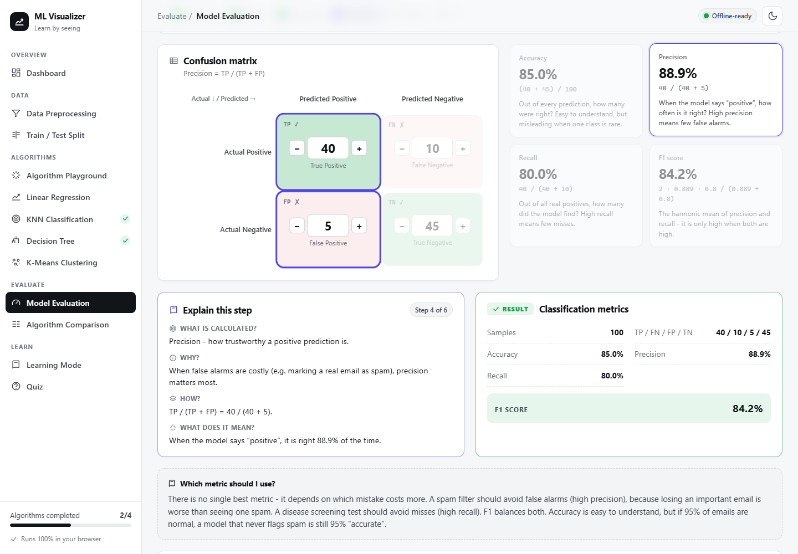
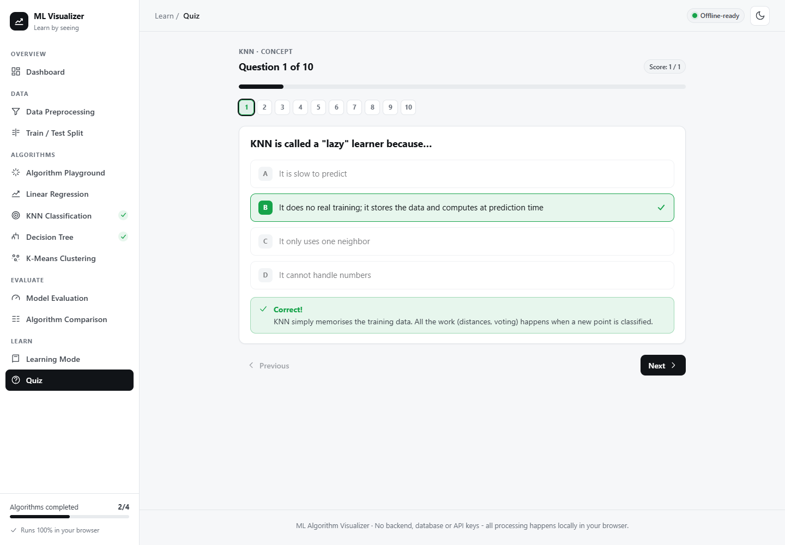
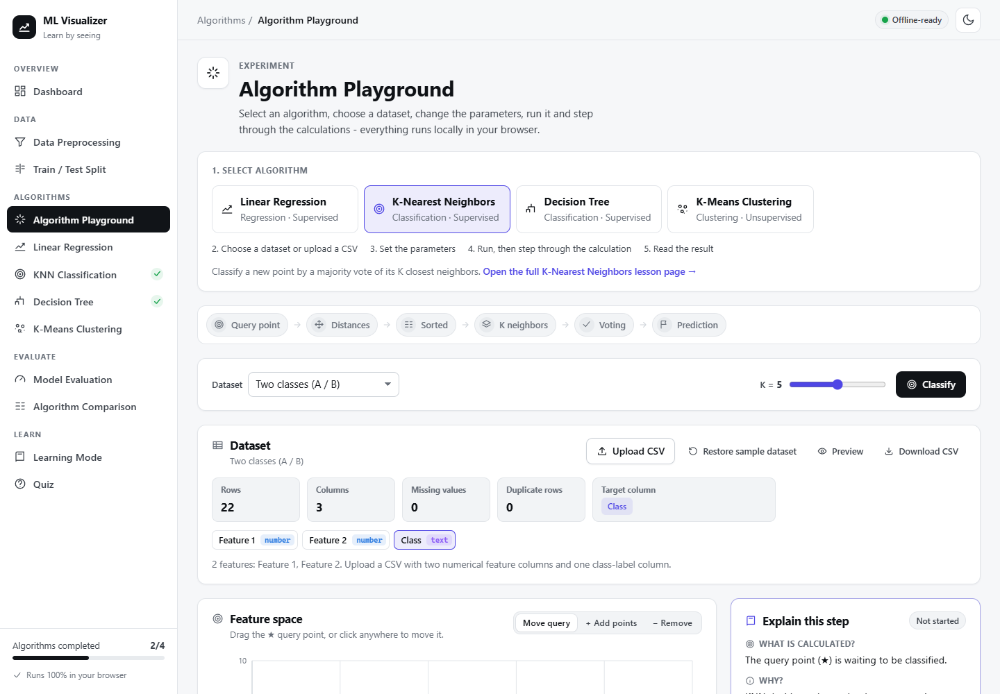

# ML Algorithm Visualizer

**Learn Machine Learning algorithms through interactive visualizations.**

ML Algorithm Visualizer is a **frontend-only educational ML visualization platform**. It shows how Linear Regression, K-Nearest Neighbors, Decision Trees (ID3) and K-Means Clustering work, one calculation at a time, alongside data preprocessing, train/test splitting and model evaluation.

> **This project does not require a backend, database, or API keys. All processing is performed locally in the browser.**

**Live demo:** https://srbaggari.github.io/ml-algorithm-visualizer/



---

## Overview

Most learners meet ML algorithms as formulas or as one-line library calls such as `model.fit()`. This project opens the black box. Every algorithm is implemented from scratch in plain JavaScript, and every intermediate value is shown as the learner steps through the run: means, distances, entropies, information gains, centroid positions and metrics.

Each algorithm page follows the same structure, so the four algorithms feel like parts of one platform rather than four separate demos:

| # | Section | What it shows |
| --- | --- | --- |
| 1 | Title and short explanation | What the algorithm does |
| 2 | What problem it solves | When you would use it, plus a one-click **demo** |
| 3 | Concept flow | e.g. *Query point → Distances → Sorted → K neighbors → Voting → Prediction* |
| 4 | Parameters and dataset | Sample datasets, CSV upload, dataset information panel |
| 5 | Interactive visualization | An SVG chart that changes at every step, with a text caption |
| 6 | Step controller | Previous / Play / Pause / Next / Reset, "Step 3 of 6" |
| 7 | Explain this step | *What* is calculated, *why*, *how*, and *what the result means* |
| 8 | Calculation details | The formula with the real numbers substituted in |
| 9 | Result card | The final calculated result |
| 10 | Formula panel | Every formula with a plain-language explanation; the current one is highlighted |
| 11 | Key takeaways and lesson | A summary plus an expandable lesson |

## Features

- **Dashboard:** algorithms available, learning progress, algorithms completed, best quiz score, recently viewed algorithms, one-click demos, algorithm cards with completion status, a learning path and recent activity.
- **Algorithm Playground:** pick any algorithm, then choose a dataset, set parameters, run, step through, and read the calculations and final result, all in one place.
- **Demo mode:** every algorithm can load its sample dataset and pause at step 1 with one click (`?demo=1`). No setup is needed.
- **Step-by-step animation system:** one shared `StepController` and `useStepPlayer` hook drive every visualization. Timers are cleared on pause and unmount.
- **Explain this step:** beginner-friendly explanations built from the actual calculated values.
- **Formula panel:** slope, intercept, prediction, MSE, R², Euclidean distance, entropy, information gain, centroid mean, accuracy, precision, recall and F1.
- **Result cards:** for example *K value 5 · Class A votes 4 · Class B votes 1 · Final prediction: Class A*.
- **Dataset panel:** name, rows, columns, feature names, data types, missing values, duplicate rows and target column. Upload, preview, restore the sample, and download as CSV.
- **Report downloads:** a `.json` or `.txt` learning report (algorithm, dataset, parameters, results and metrics), generated in the browser.
- **Learning progress (LocalStorage):** tracks algorithms opened, algorithms completed, lessons learned, quiz scores, recently viewed algorithms and dismissed tips. **Reset Learning Progress** asks for confirmation in an accessible dialog.
- **Dark and light mode:** saved locally, with charts tuned for both themes.
- **Accessibility:** semantic HTML, labelled controls, keyboard navigation, visible focus rings, a skip link and `prefers-reduced-motion` support. Every chart has a text caption, and information is never shown by colour alone: classes use different marker shapes, and cells are marked ✓/✗.
- **Responsive:** tested at 320, 375, 425, 768 and 1024 px and on desktop, with no horizontal page overflow.
- **Friendly errors:** invalid CSV files, missing columns, invalid K values or ratios, and too-small datasets all produce clear messages. Raw JavaScript errors are never shown.

## Algorithms

All algorithms live in [`src/algorithms/`](src/algorithms/). No ML libraries are used.

| Algorithm | Type | What is implemented |
| --- | --- | --- |
| **Linear Regression** | Supervised regression | Ordinary least squares: `b₁ = Σ(x−x̄)(y−ȳ) / Σ(x−x̄)²`, `b₀ = ȳ − b₁x̄`, predictions, residuals, MSE, RMSE, R² |
| **K-Nearest Neighbors** | Supervised classification | Euclidean distance, stable ranking, top-K majority vote, tie-breaking by total distance, decision regions |
| **Decision Tree (ID3)** | Supervised classification | Entropy `H = −Σ p·log₂p`, information gain, greedy recursive splitting, leaf rules (pure / no attributes / no gain), majority fallback for unseen values |
| **K-Means** | Unsupervised clustering | Random or K-Means++ initialisation, assign → update iterations, empty-cluster handling, convergence detection, inertia per iteration |









## Data Preprocessing

Upload any CSV, or use a sample. The app detects rows, columns, numeric and categorical columns, missing values and duplicate rows automatically. You then apply operations **one at a time**:

- remove duplicate rows
- handle missing values: mean, median or mode imputation, or remove rows
- label encoding
- Min-Max scaling or standardization

Every operation is shown as **BEFORE → PROCESS → AFTER**, with a "what changed" table. You can **undo** the last operation, **reset** the dataset, inspect any step in the history, and **download the processed CSV**. The CSV is generated in the browser.



## Model Evaluation

- **Interactive confusion matrix:** edit TP, FN, FP and TN directly, and accuracy, precision, recall and F1 update instantly. Each metric comes with a beginner explanation.
- **Threshold explorer:** a spam-filter example with a metrics-vs-threshold chart.
- **Walkthrough:** a step-by-step guide that highlights the matrix cells and formula used by each metric.
- Undefined metrics (division by zero) are labelled "undefined" instead of showing `NaN`.



## Learning Mode

Seven lessons: Preprocessing, Train/Test Split, Linear Regression, KNN, Decision Tree, K-Means and Evaluation. Each lesson has expandable sections:

- Definition and Intuition
- How It Works and Mathematical Concept
- Step-by-Step Example, with small numbers you can check by hand
- Advantages and Limitations
- Real-World Applications and Important Terms

Each lesson has a **Mark as Learned** button. The unit tests check that the worked examples match what the algorithms actually compute.

## Quiz

- **38 questions** in four types: multiple choice, concept, calculation and scenario.
- A progress bar, question navigation, Previous / Next / Submit, and an optional per-question timer.
- Instant feedback and an explanation for every answer.
- **Results:** score, correct, incorrect, percentage, **topics to revise** (linked to lessons), breakdowns by topic and by type, and a full answer review.
- The **best score** is saved locally. You can **retake** the quiz.



## Technology Stack

- **React 18** with **React Router 6** (HashRouter, so it works on any static host)
- **JavaScript (ES modules)**, **HTML** and hand-written **CSS** with custom-property design tokens (no CSS framework)
- **SVG** for every visualization and chart; the line and bar charts are built in, with no chart library
- **LocalStorage** for theme and learning progress
- **Vite** for development and bundling
- **Node's built-in test runner** (`node:test`) for unit tests

Runtime dependencies: `react`, `react-dom` and `react-router-dom`. Development dependencies: `vite` and `@vitejs/plugin-react`.

## Project Structure

```
src/
├── algorithms/            Pure, testable algorithm logic (no React)
│   ├── linearRegression.js   knn.js   decisionTree.js   kmeans.js
├── components/            Reusable UI
│   ├── StepController.jsx     global Previous/Play/Pause/Next/Reset
│   ├── ExplainStep.jsx        what / why / how / meaning of the current step
│   ├── FormulaPanel.jsx       formulas + plain-language explanations
│   ├── AlgorithmSections.jsx  intro, result card, key takeaways, first-time hints
│   ├── DatasetInfo.jsx        dataset panel (upload / preview / reset / download)
│   ├── ConfirmDialog.jsx      accessible confirmation dialog
│   ├── ConceptFlow.jsx, LearningPanel.jsx, ReportButton.jsx
│   ├── ChartFrame.jsx, MiniCharts.jsx, Marker.jsx, ConfusionMatrix.jsx
│   └── Navbar.jsx, Sidebar.jsx, DatasetTable.jsx, CsvUpload.jsx, ColumnPicker.jsx, ...
├── pages/                 Dashboard, Preprocessing, TrainTestSplit, Playground,
│                          LinearRegression, KNN, DecisionTree, KMeans,
│                          Evaluation, Comparison, Learn, Quiz, NotFound
├── hooks/                 useStepPlayer, useElementSize, useReducedMotion
├── context/AppContext.jsx theme + learning progress (LocalStorage)
├── data/                  datasets, quiz questions, lessons, formulas,
│                          page guides, step explanations, algorithm metadata
├── utils/                 csvParser, preprocessing, metrics, split, report,
│                          errors, storage, random, format
└── styles/                base, layout, components, pages, features, platform
tests/                     one test file per area (node:test)
docs/screenshots/          README screenshots
```

## How It Works

1. **Algorithms record everything.** Each algorithm returns every intermediate value: the regression table, the KNN ranking, the ID3 decision trace, and the list of K-Means states.
2. **One player replays it.** `useStepPlayer` walks through those recorded steps. `StepController` provides Previous / Play / Pause / Next / Reset, and the chart, "Explain this step", calculation details and formula panel all read the same current step.
3. **Explanations use real numbers.** The functions in `src/data/stepExplanations.js` turn the calculated values into plain language, for example *"Entropy = 0.940 - the labels are very mixed…"*.
4. **Errors are user-safe.** Algorithms and utilities throw `UserError` with a friendly message. Anything unexpected is replaced by a generic message, and an error boundary keeps the rest of the app working.

## Installation

Requirements: **Node.js 18 or newer** and npm.

```bash
git clone <your-repository-url> ml-algorithm-visualizer
cd ml-algorithm-visualizer
npm install
```

## Running Locally

```bash
npm run dev       # development server (open the printed URL, usually http://localhost:5173)
npm test          # unit tests for algorithms, metrics, preprocessing, split, CSV and content
npm run build     # production build in dist/
npm run preview   # serve the production build locally
```

The production build uses relative paths and hash routing, so the `dist/` folder can be deployed to any static host (GitHub Pages, Netlify, Vercel, S3, …) without server configuration.

### Deployment

The live site is hosted on **GitHub Pages**. On every push to `main`, the [`deploy` workflow](.github/workflows/deploy.yml) installs dependencies, runs the unit tests, builds the app and publishes `dist/` to the `gh-pages` branch, which GitHub Pages serves. If the tests fail, nothing is deployed.

## Offline Architecture

- **No backend, database, authentication, API keys or AI services.** The source contains no `fetch`, no HTTP client and no environment variables.
- **All datasets are bundled:** Hours Studied vs Exam Score, a two-class 2D dataset and an Iris-style dataset, Play Tennis and Loan Approval, customer segments, student records and spam-filter scores.
- **Uploaded CSV files are read with `FileReader`** and processed in memory. They are never sent anywhere.
- **Downloads** (processed CSV and reports) are generated with `Blob` URLs in the browser.
- **No web fonts or CDN assets:** the app uses the system font stack and inline SVG icons.
- During development, a scripted browser session used every page and recorded every network request. All requests went to the local server only.

## Screenshots

| | |
| --- | --- |
|  |  |
|  |  |
|  |  |
|  |  |
|  | |

## Future Enhancements

- Logistic regression, Naive Bayes and SVM visualizers
- Multiple linear regression and gradient-descent training
- Gini impurity, numeric thresholds and pruning for decision trees (CART / C4.5)
- The elbow method and silhouette score for choosing K in K-Means
- k-fold cross-validation and ROC / AUC curves
- Exporting visualizations as images, and an installable PWA

## Limitations

- **Two features for the scatter-based algorithms:** Linear Regression, KNN and K-Means work with two features (one input for regression) so that everything can be drawn in 2D.
- **Categorical decision trees:** the tree uses categorical attributes (at most 10 distinct values per column); continuous columns are skipped.
- **Dataset size:** uploads are limited to 5 MB and 5,000 rows, and visualizations use at most 200–300 points to stay readable and fast.
- **Browser-only progress:** progress is stored in this browser's LocalStorage, so it doesn't sync between devices, and clearing site data resets it.
- **Touch dragging:** dragging the KNN query point uses a mouse or pen. On touch screens, tap the chart or type coordinates to move it.

## License

No license file is included yet. Add one (for example MIT) before publishing if you want others to be able to reuse the code.
